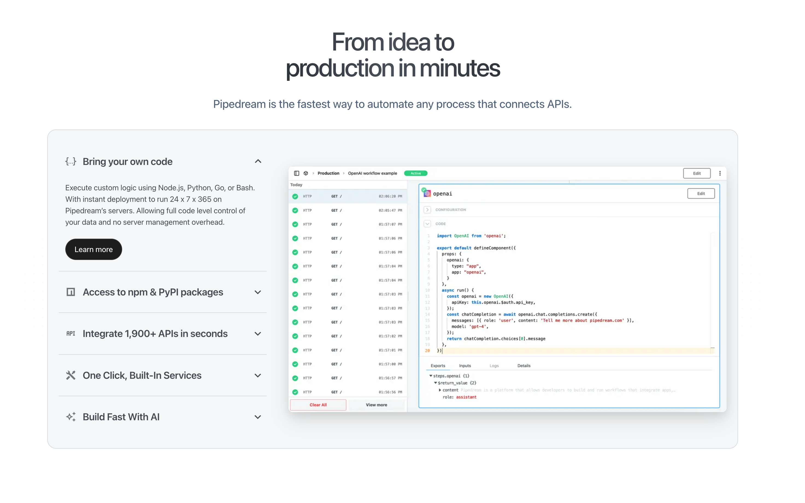

# Home Page

I want the Pipedown home page to spell out why writing code with Pipedown is superior to doing so with traditional tools and files. Some of the key points to cover will be the:
- Executable Markdown
  - It's just Markdown.
- Simplified mental model
  - It's just Markdown!
- Universal applicability
  - Exports to almost anything
- Shorten time from idea to _publishing_
  - Deploy to any host
- "Self" documenting
  - Marry your code to Markdown
  - Code is meant for reading, seamlessly mix prose, brain dumps, share mental context
- I can't believe it's just markdown!
- Constraints/Guard rails/Pipes

TODO: What's not clear yet is how I want to position the tool. Should I write/design the home page to discuss the Pipedown "core" library, or move on straight to the SaaS, which is still quite far off! Perhaps focus on the "core", which is potentially open source-able, and already capable of delivering value, I'm just not sure I want to make it public until I know how I want to monetize it.

Some SaaS/software tool home pages I like:
- https://laravel.com/
  - Simple, no fluff
- https://pipedream.com/
  - A similarly positioned, and named, tool
  - These interactive sections seem useful for condensing a lot of features into one slice of the page
  - 
- https://nodered.org/
- https://deno.com/

```json
{
    "logo": "https://tailwindui.com/img/logos/mark.svg?color=indigo&shade=600",
    "copy": {
        "h1": "Write Markdown, Execute Anywhere",
        "subtitle": "Anim aute id magna aliqua ad ad non deserunt sunt. Qui irure qui lorem cupidatat commodo. Elit sunt amet fugiat veniam occaecat fugiat aliqua."
    },
    "build": ["esm"]
}
```

```ts
import { DOMParser } from "https://esm.sh/linkedom/worker";
if(!input.DOMParser) input.DOMParser = new DOMParser();
if(!input.layout) input.layout = input.DOMParser.parseFromString('')
```

## defaultLayout
```ts
import layout from 'layout';
Object.assign(input, await layout.process(input));
```

## heroSection
Lifted [this hero section](https://tailwindui.com/components/marketing/sections/heroes) from Tailwindui. 

The complexity of the component makes my brain spin. No doubt great thought has gone into the example, particularly to make the diagonal... shadow(?) seamlessly cross from outside to inside the code example. Daisyui has a lovely components that will fit nicely within this layout, like these [Code mockup](https://daisyui.com/components/mockup-code/) examples.
```ts
input.layout.querySelector('title').textContent = 'Home';
const heroContainer = input.layout.createElement('div');
heroContainer.classList.add('hero')
input.layout.querySelector('#app').appendChild(heroContainer);

const whatsNew = `<div class="mt-24 sm:mt-32 lg:mt-16">
    <a href="#" class="inline-flex space-x-6">
    <span class="rounded-full bg-indigo-600/10 px-3 py-1 text-sm font-semibold leading-6 text-indigo-600 ring-1 ring-inset ring-indigo-600/10">What's new</span>
    <span class="inline-flex items-center space-x-2 text-sm font-medium leading-6 text-gray-600">
        <span>Just shipped v0.1.0</span>
        <svg class="h-5 w-5 text-gray-400" viewBox="0 0 20 20" fill="currentColor" aria-hidden="true">
        <path fill-rule="evenodd" d="M7.21 14.77a.75.75 0 01.02-1.06L11.168 10 7.23 6.29a.75.75 0 111.04-1.08l4.5 4.25a.75.75 0 010 1.08l-4.5 4.25a.75.75 0 01-1.06-.02z" clip-rule="evenodd" />
        </svg>
    </span>
    </a>
</div>`

const heroNav = `<div class="mt-10 flex items-center gap-x-6">
    <a href="#" class="rounded-md bg-indigo-600 px-3.5 py-2.5 text-sm font-semibold text-white shadow-sm hover:bg-indigo-500 focus-visible:outline focus-visible:outline-2 focus-visible:outline-offset-2 focus-visible:outline-indigo-600">Documentation</a>
    <a href="#" class="text-sm font-semibold leading-6 text-gray-900">View on GitHub <span aria-hidden="true">→</span></a>
</div>`

const codeExample = `<pre><code>
# Pages

&#768;&#768;&#768;ts
input.DOMParser = new DOMParser();
&#768;&#768;&#768;

## defaultLayout
&#768;&#768;&#768;ts
Object.assign(input, await layout.process(input));
&#768;&#768;&#768;
</code></pre>`

const codeExamplePresentation = `<div class="mt-20 sm:mt-24 md:mx-auto md:max-w-2xl lg:mx-0 lg:mt-0 lg:w-screen">
<div class="absolute inset-y-0 right-1/2 -z-10 -mr-10 w-[200%] skew-x-[-30deg] bg-white shadow-xl shadow-indigo-600/10 ring-1 ring-indigo-50 md:-mr-20 lg:-mr-36" aria-hidden="true"><!-- wat --></div>
<div class="shadow-lg md:rounded-3xl">
    <div class="bg-indigo-500 [clip-path:inset(0)] md:[clip-path:inset(0_round_theme(borderRadius.3xl))]">
    <div class="absolute -inset-y-px left-1/2 -z-10 ml-10 w-[200%] skew-x-[-30deg] bg-indigo-100 opacity-20 ring-1 ring-inset ring-white md:ml-20 lg:ml-36" aria-hidden="true"><!-- wat --></div>
    <div class="relative px-6 pt-8 sm:pt-16 md:pl-16 md:pr-0">
        <div class="mx-auto max-w-2xl md:mx-0 md:max-w-none">
        <div class="w-screen overflow-hidden rounded-tl-xl bg-gray-900">
            <div class="flex bg-gray-800/40 ring-1 ring-white/5"><!-- wat --></div>
            <div class="mockup-code px-6 pb-14 pt-6 text-white">
            {codeExample}
            </div>
        </div>
        </div>
        <div class="pointer-events-none absolute inset-0 ring-1 ring-inset ring-black/10 md:rounded-3xl" aria-hidden="true"><!-- wat --></div>
    </div>
    </div>
</div>
</div>
</div>`

heroContainer.innerHTML = `<div class="bg-white">
  <div class="relative isolate overflow-hidden bg-gradient-to-b from-indigo-100/20">
    <div class="mx-auto max-w-7xl pb-24 pt-10 sm:pb-32 lg:grid lg:grid-cols-2 lg:gap-x-8 lg:px-8 lg:py-40">
      <div class="px-6 lg:px-0 lg:pt-4">
        <div class="mx-auto max-w-2xl">
          <div class="max-w-lg">
            
            ${whatsNew}
            <h1 class="mt-10 text-4xl font-bold tracking-tight text-gray-900 sm:text-6xl">${opts.config.copy.h1}</h1>
            <p class="mt-6 text-lg leading-8 text-gray-600">${$p.get(opts, '/config/copy/subtitle')}</p>
            ${heroNav}
          </div>
        </div>
      </div>
      ${codeExamplePresentation}
    <div class="absolute inset-x-0 bottom-0 -z-10 h-24 bg-gradient-to-t from-white sm:h-32"><!-- wat --></div>
  </div>
</div>
`
```


## Just Write Markdown
A format most coders will be familiar with. Enhanced with just a few conventions to simplify life. 
```
```

## Execute the Code Blocks
All Typescript code blocks are executed in sequence, and anything added to the global `input` object is _piped down_ To the next code block!
Marry your code with a gloriously expressive, publishable format
Test inputs, config, conditional execution, import other pipes and more!
```
```

## Export for any usecase
Pipedown exports your
```
```


## respondWithHtml
```ts
Object.assign(input.responseOptions.headers, { "content-type": "text/html" });
input.responseOptions.status = 200;
input.body = input.layout.toString();
console.log(input.body);
```